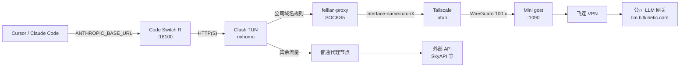
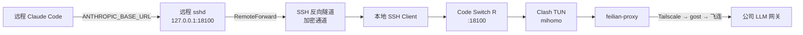

# 飞连 VPN 与开发机代理隔离方案

## 1. 背景与动机

- 公司 LLM 网关（如 `llm.bitkinetic.com`）仅在**飞连 VPN** 可达；个人另购 SkyAPI 等作为补充。
- 开发机本机再装飞连易与 **Clash（mihomo）TUN** 的路由/DNS/虚拟网卡冲突；飞连多为 GUI、无可靠无头方案，不适合塞进容器常驻。
- 目标：飞连流量与普通代理流量在**同一套 Clash 规则**下分流；公司出口在**长期在线的专用机器**，开发机经加密隧道访问；外出时用 **Tailscale IP** 连 Mini。

## 2. 约束

| 约束 | 说明 |
|------|------|
| 飞连 | 字节系企业 VPN，多需 GUI 与设备绑定，难在 Linux 容器可靠运行 |
| 本地开发机 | macOS，已安装 mihomo（含 TUN）+ Tailscale + Code Switch R，统一接管出站 |
| 远程开发机 | VPS / 公司 Linux 机器，通过 SSH 反向隧道使用本地 Code Switch R，无需单独部署代理 |
| 工具链 | Cursor / Claude Code → **Code Switch R** → Clash |
| 可达性 | Mini 需 **Tailscale** 暴露 SOCKS |

## 3. 技术选型

### 3.1 独立 Mac Mini 跑飞连

专用小主机与开发机解耦，登录一次长期在线；适合飞连依赖桌面客户端的场景。

### 3.2 Mini 上 gost 暴露 SOCKS5

飞连连通后，本机已能访问公司内网；需在**同一协议栈**上提供**固定端口入站**，供远端经隧道接入。**gost** 监听 **SOCKS5**，可与 launchd 常驻。

### 3.3 Tailscale 而非仅 LAN

外出时无法直连公司 LAN。Tailscale（WireGuard mesh）给 Mini 稳定 `100.x` 地址，开发机与 Mini 建 peer，**无需公网映射**即可访问 gost 端口。

### 3.4 开发机仍用 Clash 分流

应用（含 Code Switch R）进 **Clash TUN**：公司 API 域名 → **feilian-proxy**（SOCKS 到 Mini:gost）；其余走原代理策略。规则集中，不必在 IDE 拆两套代理。

### 3.5 出站绑定 utun 与自动检测

macOS 上 Clash TUN 接管路由；访问 Tailscale 对端若未绑对 **utun**，易 TLS 不稳。**utun 编号会随重连变**，生成配置时用脚本检测通往 Mini Tailscale IP 的接口，写入 `feilian-proxy` 的 `interface-name`。

### 3.6 规则集外置（clash-rules）

公司域名、Tailscale 相关域名用 **rule-provider** 从 **clash-rules** 拉取（如 `my-feilian`、`my-tailscale`），与 `base.yaml` 分离维护。

## 4. 术语

| 名词 | 含义 |
|------|------|
| 飞连 | 字节系企业 VPN；由 Mini 登录。 |
| gost | 开源代理程序。本方案里在 Mini 上**监听本机 1090 端口**，对外提供 **SOCKS5 服务**：开发机把流量送到该端口，连接仍由 Mini（已登飞连）发往公司内网。|
| SOCKS5 | 一类代理协议：客户端先连到代理服务器，再说明要访问的真实目标；不关心上层是网页还是 API。Clash 里节点类型选 `socks5`、填 Mini 的地址与 1090，即按该协议与 gost 对话。 |
| Tailscale | 虚拟组网（WireGuard），常见 `100.64.0.0/10`。 |
| Clash / mihomo | 规则代理内核；TUN 在系统层分流。 |
| Code Switch R | 本地多供应商入口（如 `:18100`）与切换。 |
| launchd | macOS 服务管理；gost 自启/保活。 |
| rule-provider | Clash 从 URL 拉取远程规则 YAML；本方案中 `my-feilian` / `my-tailscale` 指向 clash-rules 仓库。 |

## 5. 数据流

### 5.1 本地 Mac 数据流



### 5.2 远程机器数据流（SSH 反向隧道）



### 5.3 步骤说明

1. Cursor / Claude Code → `ANTHROPIC_BASE_URL` 指向 Code Switch R。
2. Code Switch R 按优先级请求公司或个人 API。
3. HTTP(S) 进入 **Clash TUN**。
4. 公司 API 域名 → **feilian-proxy** → **Tailscale** → Mini **gost :1090** → 飞连通道 → 公司网关。
5. 其余按原策略走代理或直连。
6. 远程机器通过 SSH 反向隧道透明接入本地 Code Switch R，后续链路与本地一致。

## 6. 组件职责

| 位置 | 职责 |
|------|------|
| Mac Mini | 飞连、gost、（可选）屏幕共享重认证 |
| 开发机 | mihomo、Tailscale、Code Switch R、同步脚本产出配置 |
| clash-rules | `feilian` / `tailscale` 等规则集 |
| 同步脚本 | 合并平台配置、检测 Tailscale 接口、部署 mihomo 配置并热重载 |

## 7. 运维

- Mini 长期在线；`pmset` 减休眠；飞连过期用 **VNC/屏幕共享** 登录。
- Tailscale 异常时重跑同步脚本刷新 **interface-name**。
- 先推送 **clash-rules**，再让 Clash 拉规则 URL，避免 404。

## 8. Claude Code 与 zkme

经 **zkme** 作为 provider 接入时，Claude Code 侧仍需关闭实验性 beta 通道，否则与网关/路由组合易不稳定。在环境或 Claude Code 配置中保留：

```json
"CLAUDE_CODE_DISABLE_EXPERIMENTAL_BETAS": "1"
```

## 9. SSH 反向隧道：远程机器共享 Code Switch R

在远程 VPS / 开发机上使用 Claude Code 时，通过 SSH `RemoteForward` 将本地 Mac 的 Code Switch R（`:18100`）映射到远程 `127.0.0.1:18100`，无需在远程机器单独部署代理。

### 9.1 原理

SSH 连接时自动建立反向隧道：远程 `127.0.0.1:18100` → SSH 加密通道 → 本地 Mac `127.0.0.1:18100`（Code Switch R）→ Clash TUN → 按规则分流。远程 Claude Code 配置与本地完全一致。

### 9.2 SSH 配置

在 `~/.ssh/config.d/` 对应文件中为目标 Host 添加：

```
RemoteForward 18100 127.0.0.1:18100
ExitOnForwardFailure no
ServerAliveInterval 30
ServerAliveCountMax 3
```

- `ExitOnForwardFailure no`：多个 SSH 会话同时连接时，后续会话跳过转发但连接不中断（第一个会话已持有转发）。
- `ServerAliveInterval/CountMax`：30s 心跳，90s 无响应断开，防止僵尸连接占用端口。

### 9.3 已配置的机器

| Host | 文件 | 连接方式 | 用途 |
|------|------|----------|------|
| `netcup` | `~/.ssh/config.d/vps.sconf` | Tailscale IP | 欧洲 VPS |
| `test39` | `~/.ssh/config.d/idea.sconf` | LAN IP | 公司开发机 |

### 9.4 远程 Claude Code 配置

远程 `~/.claude/settings.json` 中 env 与本地一致：

```json
{
  "ANTHROPIC_AUTH_TOKEN": "code-switch-r",
  "ANTHROPIC_BASE_URL": "http://127.0.0.1:18100",
  "CLAUDE_CODE_DISABLE_EXPERIMENTAL_BETAS": "1"
}
```

### 9.5 使用与验证

```bash
ssh netcup                                    # 隧道自动建立
curl -s http://127.0.0.1:18100/health         # 验证隧道连通
claude                                        # 直接使用
```

隧道仅在 SSH 会话存活期间有效。Cursor Remote SSH 连接也会自动读取同一份 SSH 配置。

## 10. 相关仓库

- Clash：`womenlia/clash`，本机 macOS 场景改 `config/base.yaml`、`config/macos/platform.yaml`，勿手改生成的 `config/macos/mihomo.yaml`。
- 规则：`phenix3443/clash-rules`（`rules/feilian.yaml`、`rules/tailscale.yaml` 等）。
- Mini 初始化：`womenlia/home-lab` 下 `macos/setup-mini.sh`。
