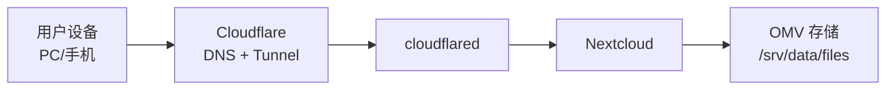

## 方案概述

该需求采用 **Nextcloud + Cloudflare Tunnel**：

- **Nextcloud**：提供同步、分享、版本、回收站、多端客户端
- **Cloudflare Tunnel（cloudflared）**：提供对外 HTTPS 入口，不开放端口
- **（可选）Cloudflare Access**：为外网访问加一层身份验证

OMV 负责存储与容器运行。

## 目录规划

建议在 OMV 上准备：

- **Nextcloud 数据目录**：`/srv/data/files`
- **Nextcloud 应用/配置**：`/srv/data/appdata/nextcloud`
- **Compose**：`/srv/data/appdata/compose/nextcloud`
- **备份**：`/srv/data/backups`

## 访问架构

## 权限模型

- 你与老婆：各自 Nextcloud 账号
- 共享目录：使用 Nextcloud 内置共享（可写/只读）
- 对外分享：
  - 优先：Nextcloud 分享链接 + 密码 + 过期时间
  - 私密分享：再叠加 Cloudflare Access（邮箱 OTP）

## 备份策略（最小可用）

至少备份：

- Nextcloud 数据目录：`/srv/data/files`
- Nextcloud 数据库（容器卷）
- `docker-compose.yml` 与 `.env`

建议采用：

- 本地外置盘定期备份（restic/rclone/rsync 任一）
- 每月做一次恢复演练（恢复一个目录并验证客户端可见）

