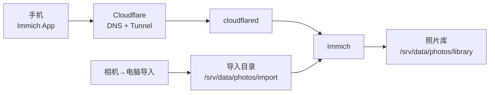

## 方案概述

该需求采用 **Immich + Cloudflare Tunnel**：

- **Immich**：照片备份、索引、搜索、人脸识别、共享相册
- **Cloudflare Tunnel（cloudflared）**：外网 HTTPS 入口（不开放端口）
- **（可选）Cloudflare Access**：保护私密访问（推荐至少保护管理入口）

OMV 负责存储与容器运行。

## 目录规划

建议在 OMV 上准备：

- Immich 应用数据：`/srv/data/appdata/immich`
- 照片库：`/srv/data/photos/library`
- 相机导入目录：`/srv/data/photos/import`
- 备份：`/srv/data/backups`

## 访问架构

## 相机入库策略（推荐两选一）

### 方案 A：导入目录 + External Library（推荐）

- 电脑把相机照片复制到 `import/`
- Immich 配置 External Library 指向 `import/` 并定期扫描/导入

优点：流程清晰；缺点：需要一次“导入动作”（但可脚本化）。

### 方案 B：通过 Nextcloud 同步后再导入

- 相机照片先进入 Nextcloud 的某个目录
- 服务器侧同步到 `import/` 或直接让 Immich 扫描 Nextcloud 的目录

优点：电脑端体验统一；缺点：链路更长。

## 备份策略（最小可用）

至少备份：

- 照片库目录：`/srv/data/photos/library`
- Immich 数据库卷（PostgreSQL）
- `docker-compose.yml` 与 `.env`

建议：

- 本地外置盘定期备份 + 异地备份（3-2-1）
- 恢复演练：恢复数据库后能检索到照片、相册与人脸索引可重建

