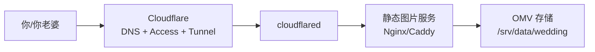

## 方案概述

该需求建议以“静态图片服务 + Cloudflare”作为主路径，并可复用 Nextcloud/Immich 的分享能力作为最小落地。

两条主线：

- **A（私密）**：Cloudflare Tunnel + Cloudflare Access + 静态图片服务
- **B（公开）**：静态图片服务公开目录 + Cloudflare 缓存

OMV 负责存储与容器运行。

## 目录规划

- 图片根目录：`/srv/data/wedding`
  - `private/`（私密）
  - `public/`（公开，可选）

## 架构（推荐：私密）

## 访问控制策略

### 私密（推荐）

- 对 `wedding.example.com` 启用 Cloudflare Access
- 仅允许你与老婆的邮箱/身份提供方登录
- 公开分享需要时再添加单独的 public hostname 或路径策略

### 公开（可选）

两种做法：

- **做法 1**：同域名下仅公开 `public/` 路径（需要 Web 服务做路径隔离）
- **做法 2**：拆分子域名：
  - `wedding.example.com`（私密，Access）
  - `wedding-public.example.com`（公开）

## 与 Nextcloud/Immich 的关系

如果你不想维护静态服务，也可以：

- 直接用 Nextcloud/Immich 的分享链接给网站引用
- 适合最早期快速上线
- 缺点：链接形态与权限模型受应用限制

## 备份策略

至少备份：

- `/srv/data/wedding`（图片文件）
- `docker-compose.yml` 与反代/隧道配置（如果使用静态服务）

公开模式下建议利用 Cloudflare 缓存，但不要把缓存当备份。

