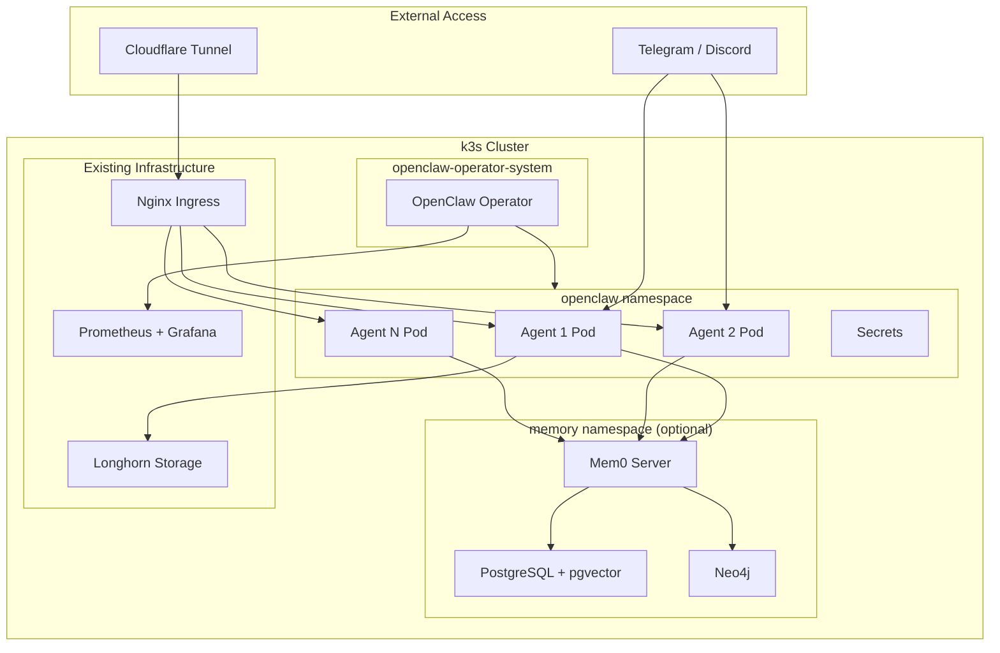

# OpenClaw on k3s

> 在 k3s 集群上部署生产级 OpenClaw Agent，使用 OpenClaw Kubernetes Operator 管理。

---

## 概述

使用 [OpenClaw Kubernetes Operator](https://github.com/OpenClaw-rocks/k8s-operator) 在现有 k3s 集群上部署 2-5 个 Agent 实例，复用 Longhorn 存储、Nginx Ingress、Cloudflare Tunnel、Prometheus 监控等基础设施。

**核心决策**：

- 使用**第三方 API 代理**（SkyAPI 提供 Claude/GPT，阿里云百炼 Coding Plan 提供 Qwen/Kimi/GLM 等），不跑本地模型
- Agent 可在运行时自由切换模型（`/model` 命令），通过 `models.providers` 配置自定义 provider
- 集成 **LanceDB 向量记忆**（auto-recall/capture），Agent 跨会话保留上下文
- 通过 **Tailscale** 内网访问 + **Cloudflare Tunnel** 公网暴露
- 启用 **selfConfigure**，Agent 可自主安装 skills、修改配置

---

## 架构



---

## 当前状态

| 组件 | 状态 | 备注 |
|------|------|------|
| Operator | ✅ Running | openclaw-operator-system（已按运行期缓存同步需要上调资源） |
| agent-primary | ✅ 5/5 Running | 默认模型 aliyun/qwen3.5-plus |
| Secrets | ✅ SkyAPI + Aliyun | openclaw-api-keys |
| CoreDNS | ✅ 已修复 | forward 8.8.8.8 （绕开 Clash fake-ip) |
| Ingress | ✅ 已配置 | openclaw.panghuli.tech via Cloudflare Tunnel |
| NetworkPolicy | ✅ 已启用 | 允许 ingress-nginx + 出站 80/443 |
| Monitoring | ✅ 已配置 | ServiceMonitor + PrometheusRule 告警 |
| Longhorn 备份 | ✅ 已配置 | 每 6h 快照；daily backup 见 `longhorn-backup.yaml`（需 S3 target） |
| Tailscale | ✅ 已启用 | agent-primary.tail1eafd1.ts.net |
| Memory | ✅ LanceDB | 向量记忆 auto-recall/capture (embedding via Aliyun) |
| Skills | ✅ 7/51 ready | jq, rg, gh, ffmpeg via init container |
| selfConfigure | ✅ 已启用 | Agent 可自主安装 skills/修改配置 |
| 消息通道 | ⏳ 按需启用 | `setup-secrets` 创建 `openclaw-channel-keys`；在 `secrets.env` 填 `TELEGRAM_BOT_TOKEN` 后重新 `setup-secrets` |
| 异地备份 | ⏳ 需配置 target | `longhorn-backup.yaml` 已含 daily backup Job；Longhorn 须先配置 S3 兼容 backup target |
| 集群配额 | ✅ 可选 | `namespace-policies.yaml`（`apply-infra` 应用） |

## 快速开始

**5 分钟完成自动化部署**：见 **[QUICKSTART.md](../QUICKSTART.md)**

详细部署流程：

```bash
# 1. 安装 Operator
./openclaw/scripts/openclaw.sh install

# 2. 配置 Secrets（首次运行会生成模板文件）
vi openclaw/scripts/secrets.env   # 填入 API Keys（可选 TELEGRAM_BOT_TOKEN）
./openclaw/scripts/openclaw.sh setup-secrets

# 3. 测试 API 连通性
./openclaw/scripts/openclaw.sh test-secrets

# 4. 集群侧监控 / Longhorn 任务 / 配额（可重复执行）
./openclaw/scripts/openclaw.sh apply-infra

# 5. 部署主 Agent（Ingress 由脚本生成，非静态 YAML）
./openclaw/scripts/openclaw.sh create agent-primary

# 6. Operator 升级（发版后）
# ./openclaw/scripts/openclaw.sh upgrade

# 7. 查看状态
./openclaw/scripts/openclaw.sh status

# 8. 端口转发访问 UI
./openclaw/scripts/openclaw.sh forward agent-primary

# 9. 查看日志
./openclaw/scripts/openclaw.sh logs agent-primary
```

**关于 UI 里的 `Update now`**：对通过 Kubernetes Operator / 容器镜像部署的实例，这个按钮走的是容器内自更新流程，只适用于 git checkout 或全局包安装场景，不会更新 `OpenClawInstance.spec.image.tag`。在 k3s 里升级实例时，请改清单里的镜像 tag 后重新 `kubectl apply`，或让 Flux / Operator 下发变更。

### 模型配置

Agent 使用 `models.providers` 定义自定义 LLM provider（非原生 API），模型引用格式为 `provider/model`。
当前配置了 3 个 provider：

- `skyapi-claude` — Claude 系列 (Anthropic 协议，via SkyAPI 代理）
- `skyapi-openai` — GPT 系列 (OpenAI 协议，via SkyAPI 代理）
- `aliyun` — Qwen/Kimi/GLM/MiniMax (OpenAI 协议，via 阿里云百炼 Coding Plan)

Agent 运行时可通过 `/model` 命令自由切换。详见 `config/agent-primary.yaml`。

如果 Web 控制台里出现大量“未配置的模型 / provider”，不要只检查 `models.providers`。在当前版本里，模型选择器实际读取网关 `models.list`；若未配置 `agents.defaults.models`，后端会把内置 catalog 全量暴露给前端。详见 [模型目录白名单](model-catalog-allowlist.md)。

### 应用监控和备份

推荐一键应用（创建 `openclaw` 命名空间、告警规则、Longhorn RecurringJob、ResourceQuota）：

```bash
./openclaw/scripts/openclaw.sh apply-infra
```

等价于分别 `kubectl apply`：`prometheus-rules.yaml`、`longhorn-backup.yaml`、`namespace-policies.yaml`。

**Longhorn**：`openclaw-daily-backup` 在 **未配置 backup target** 时任务会失败；**一键配置**：`./scripts/setup-backup-target.sh`（需先在 `secrets.env` 填 S3 凭证，推荐 Cloudflare R2）。该脚本也会同步创建 `openclaw-operator-system/s3-backup-credentials`，让 `autoUpdate.backupBeforeUpdate` 能复用同一套 S3 目标。

**Ingress**：公网入口由 `openclaw.sh create <agent>` 内嵌 manifest 创建，仓库内无静态 `config/ingress.yaml`。参见 `docs/CLOUDFLARE_TUNNEL_SETUP.md`。

**告警通知**：PrometheusRule 只负责触发告警；**一键配置**：`./scripts/setup-alertmanager.sh`（需先在 `secrets.env` 填 Telegram Bot Token）。

**Grafana**：**一键导入**：`./scripts/setup-grafana-dashboard.sh`（自动创建 ConfigMap 或 API 导入）。

**完整自动化流程**：见 **[automation-setup.md](automation-setup.md)**。

---

## 文件说明

```
openclaw/
├── config/
│   ├── agent-template.yaml            # 新建实例模板（`create` 未命中文件时生成）
│   ├── hanbao.yaml                    # 当前部署实例
│   ├── prometheus-rules.yaml        # PrometheusRule
│   ├── longhorn-backup.yaml         # Longhorn snapshot + daily backup RecurringJob
│   ├── namespace-policies.yaml      # openclaw ResourceQuota
│   ├── mem0-selfhosted.yaml         # 可选 Mem0 自托管栈
│   └── grafana/
│       └── openclaw-overview.json   # Grafana 看板（手动导入）
├── docs/
│   ├── README.md                    # 本文件
│   ├── deploy-plan.md
│   ├── agent-team/                  # 共享多项目 agent 团队分层文档
│   ├── disaster-recovery.md         # 恢复与备份 runbook
│   ├── alertmanager-receivers.md    # 告警路由到 Telegram 等
│   ├── production-gap-analysis.md   # 就绪度与待办
│   └── CLOUDFLARE_TUNNEL_SETUP.md
└── scripts/
    ├── openclaw.sh                  # 主脚本（全生命周期管理）
    ├── setup-backup-target.sh       # 一键配置 Longhorn S3 备份
    ├── setup-grafana-dashboard.sh   # 一键导入 Grafana Dashboard
    ├── setup-alertmanager.sh        # 一键配置 Telegram 告警
    ├── secrets.template.env
    └── secrets.env                  # ansible-vault 加密后提交（`*.local.env` 已 gitignore）
```

---

## 资源预算

| 组件 | CPU （请求/限制） | MEM （请求/限制） | 存储 |
|------|----------------|----------------|------|
| Operator | 100m/200m | 128Mi/256Mi | - |
| Agent x1 （含 Chromium) | 750m/3000m | 1.5Gi/6Gi | 10Gi |
| Agent x5 （含 Chromium) | 3750m/15000m | 7.5Gi/30Gi | 50Gi |
| Mem0 自托管 （可选） | 1250m/3000m | 3.5Gi/8Gi | 30Gi |

x86 节点池（NUC 12 核 31GB + EQ 4 核 15GB + ME 4 核 11GB = 20 核 / 57GB）可承载 5 个 Agent + Mem0 自托管。

## 实例说明

### hanbao

- 通用入口型实例
- 默认偏向综合协调、收口和多任务处理
- OpenClaw 版本巡检通过后台 `cron` 任务实现，不使用 `heartbeat`
- 当前计划任务名：`OpenClaw 更新巡检`
- 调度：每天 `09:00`（`Asia/Shanghai`）
- 用途：检查 `hanbao` 当前版本，对照 OpenClaw 官方 releases 判断是否值得更新
- 注意：该任务需要已有可用聊天路由后，`delivery.channel: last` 才能把结果投递回最近一次会话；若没有最近路由，任务会继续存在于后台但投递会 fail-closed

---

## 相关文档

- **[自动化部署指南](automation-setup.md)** — 一键配置 S3 备份、Grafana、Alertmanager、CI（推荐）
- **[模型目录白名单](model-catalog-allowlist.md)** — 为什么 Web 会出现未配置 provider，以及如何用 `agents.defaults.models` 限制模型列表
- **[共享多项目 Agent 团队](agent-team/README.md)** — 共享 Team Hub、角色分工、项目接入、试运行与后续演进
- [灾难恢复 runbook](disaster-recovery.md) — 驱逐、快照、S3 恢复、Operator 回滚
- [Alertmanager 接收器](alertmanager-receivers.md) — 将 OpenClaw 告警路由到 Telegram 等
- [完整部署计划](deploy-plan.md) — 分阶段指南、记忆系统选型、踩坑清单
- [基础设施与存储](../../infrastructure/02-deployment.md) — Longhorn 配置
- [Ingress 配置](../../k3s/docs/ingress.md) — Nginx Ingress
- [密钥管理](../../k3s/docs/secrets-management.md) — Secrets 管理方式
- [OpenClaw Operator 文档](https://openclaw.rocks/docs) — Operator CRD 完整参考
