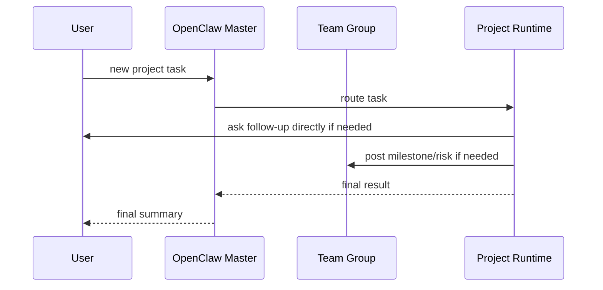

# Communication Topology Spec

## 1. 目标

定义用户、Master、Project Runtime 之间的沟通拓扑。

目标是同时满足：

- 用户始终有一个统一入口
- Runtime 可以在必要时直接补充沟通
- 多个 Runtime 的关键结论能被团队共享

## 2. 参与方

- User
- OpenClaw Master
- Team Group
- Project Runtime

## 3. 默认拓扑

建议默认使用三层沟通面：

- Master 私聊入口
- 团队群聊
- Runtime 私聊通道

## 4. 各层职责

### 4.1 Master 私聊入口

作用：

- 用户默认入口
- 用户下发任务
- Master 负责识别项目并分发任务
- Master 汇总最终结果

### 4.2 团队群聊

作用：

- 共享关键上下文
- 共享里程碑结论
- 共享阻塞信息
- 共享跨项目协调结果

群聊不要求承载所有细节，而是承载“团队可见的重要信息”。

### 4.3 Runtime 私聊通道

作用：

- 细化需求
- 补充上下文
- 长任务异步补充信息
- 项目内高频往返沟通

## 5. 默认原则

- Master 是统一默认入口
- Runtime 可以直接与用户沟通，但不应取代 Master 的统一入口角色
- 关键结论必须回流到 Master、团队群聊或项目记忆
- 不要求每个 Runtime 都必须有独立沟通通道，但架构允许存在

## 6. 推荐模式

### 模式 A：只通过 Master

适合：

- 任务简单
- 不需要高频补充上下文
- 用户希望统一入口

### 模式 B：Master + Runtime 私聊

适合：

- 任务复杂
- 项目上下文较深
- Runtime 需要和用户来回确认细节

### 模式 C：Master + 群聊 + Runtime 私聊

适合：

- 多项目协作
- 需要共享团队进展
- 需要让多个 Runtime 的关键信息公开可见

## 7. 信息回流原则

无论在哪个通道发生沟通，以下信息都应回流：

- 最终结论
- 关键风险
- 关键设计决策
- 项目状态变化
- 后续待办

回流目标可以是：

- Master
- Team Group
- `MEMORY.md`
- 项目管理工具中的 issue / PR / 项目条目

## 8. 时序示例

