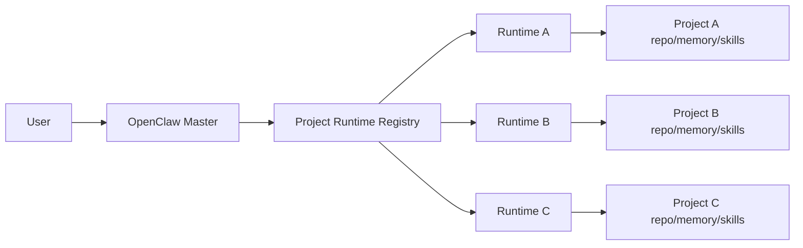

# AI Software Engineering Team Architecture

## 1. 目标

本架构用于构建一个 AI 软件工程团队：

- 用户通过统一入口与系统交互
- 每个项目拥有一个长期 Project Runtime
- 每个项目可包含一个或多个代码仓库
- Master 负责项目级路由、汇总和跨项目协调
- Runtime 负责项目内部执行、记忆沉淀和与项目作者的深入沟通

本文件只保留总架构与原则，不展开协议与实现细节。

## 2. 核心原则

- 一个项目只对应一个长期 Project Runtime
- 一个项目可拥有多个 repo，但仍只对应一个长期 Project Runtime
- 任一时刻，一个项目只能绑定一个 active Project Runtime
- 每个项目应默认绑定一个项目进度管理工具
- 第一阶段默认支持 GitHub Project
- Master 只负责调度，不负责长期深度维护具体项目
- 项目级隔离优先于会话级隔离
- 任务交接必须结构化
- Git 是声明性 workspace 的真相源，运行时状态不是
- AI team 相关定义应从 `home-lab` 基础设施仓库中拆出，集中维护在 `womenlia/ai-team`

## 3. 核心角色

### 3.1 OpenClaw Master

职责：

- 接收用户消息
- 判断消息属于哪个项目
- 路由到对应 Project Runtime
- 汇总结果
- 处理跨项目协作

### 3.2 Project Runtime

Project Runtime 是项目长期执行器。

默认实现：

- Hermes

设计层只要求存在一个可注册的 Project Runtime 实现，不在此处定义其他 Runtime 分类。

## 4. 架构分层

## 5. 隔离模型

每个项目 Runtime 必须独立拥有：

- 独立项目边界
- 一个或多个受管代码仓库
- 一个默认项目进度管理工具
- 独立运行目录
- 独立 `MEMORY.md`
- 独立 `skills/`
- 独立日志
- 独立配置
- 独立密钥作用域

## 6. 项目内部归属

项目内部由 Runtime 自己维护：

- `repo_map`
- `project_management_tool`
- workspace 结构
- skills 细节
- 项目内部自动化

这些信息不进入 Master 的核心路由模型。

在仓库边界上，当前默认约束为：

- `womenlia/ai-team` 负责维护 OpenClaw Master、Hermes Runtime、skills、bootstrap、团队规则与部署模板
- `home-lab` 负责基础设施、Flux、k3s 与集群部署入口
- `home-lab` 通过 Flux 监控 `womenlia/ai-team` 的发布结果或配置目录变化，并完成实际部署

在 skills 体系上，当前默认约束为：

- Runtime 应使用 [mattpocock/skills](https://github.com/mattpocock/skills) 作为默认开发技能体系
- Runtime 可以在此基础上增加项目专属 skills
- 项目专属 skills 不应替代这套基础工程技能，只应补充项目上下文和特定流程

在 LLM 配置上，当前默认约束为：

- OpenClaw Master 与各个 Hermes Runtime 默认复用 `hanbao` 的 LLM/provider 配置
- 不为 Master 和不同 Hermes 分别设计独立的模型目录，除非后续出现明确的成本、能力或隔离需求
- 第一阶段优先保证模型配置一致性，再考虑按项目做差异化调整

## 7. 项目执行沉淀原则

Runtime 接到用户任务后，应优先把任务沉淀到项目管理工具中，再进入具体开发流程。

以 GitHub Project 为例，建议流程为：

1. Runtime 先理解用户任务
2. 判断涉及哪些 repo
3. 按 repo 或子任务拆分为对应 issue
4. 将这些 issue 放入同一个 GitHub Project
5. 后续开发围绕 issue、分支、PR 展开

沟通沉淀原则：

- 任务拆分应沉淀到 issue
- 代码实现应绑定到 PR
- 过程讨论、补充信息、设计取舍应优先沉淀到 issue comment 或 PR comment
- Runtime 对用户的直接沟通应尽量回写到项目管理工具，避免关键信息只停留在临时聊天中

开发执行原则：

- Runtime 应优先通过 `mattpocock/skills` 中的工程化技能来完成日常开发流程
- 需求澄清、任务拆分、调试、测试、代码审查、文档更新都应尽量走可复用 skill
- 项目经验应沉淀为该项目自己的补充 skills，而不是每次重新口头描述

该原则不绑定 GitHub Project。

如果项目使用其他项目管理工具，也应遵循相同思路：

- 先把任务沉淀到项目管理工具
- 再把代码开发绑定到对应代码协作对象
- 将关键沟通尽量沉淀到可追踪记录中

## 8. 总体沟通拓扑

系统支持三层沟通面：

- Master 私聊入口
- 团队群聊
- Runtime 私聊通道

总体原则：

- Master 是默认入口
- 团队群聊负责共享协同上下文
- Runtime 可按需直接和作者沟通
- 关键结论必须回流到 Master、团队群聊或项目记忆

## 9. Runtime 选型总原则

- 当前架构只定义 `Project Runtime`
- 第一阶段默认实现是 `Hermes`
- Master 面向 Project Runtime 协议调度，不绑定某个具体实现名称

## 10. Spec 索引

详细规范拆分如下：

- 注册与 Registry:
  [project-runtime-registration-and-registry-spec.md](/Users/liushangliang/github/womenlia/home-lab/openclaw/docs/team/project-runtime-registration-and-registry-spec.md)
- 路由与消息转发:
  [project-routing-and-message-forwarding-spec.md](/Users/liushangliang/github/womenlia/home-lab/openclaw/docs/team/project-routing-and-message-forwarding-spec.md)
- 沟通拓扑:
  [communication-topology-spec.md](/Users/liushangliang/github/womenlia/home-lab/openclaw/docs/team/communication-topology-spec.md)
- Skill 体系:
  [runtime-skill-system-spec.md](/Users/liushangliang/github/womenlia/home-lab/openclaw/docs/team/runtime-skill-system-spec.md)
- Runtime 选型策略:
  [runtime-selection-policy-spec.md](/Users/liushangliang/github/womenlia/home-lab/openclaw/docs/team/runtime-selection-policy-spec.md)

## 11. 与实施文档的关系

本文件只负责说明：

- 团队形态
- 核心边界
- 总体原则
- 各 Spec 的入口

具体如何落地，见：

[project-runtime-implementation-plan.md](/Users/liushangliang/github/womenlia/home-lab/openclaw/docs/team/project-runtime-implementation-plan.md)
