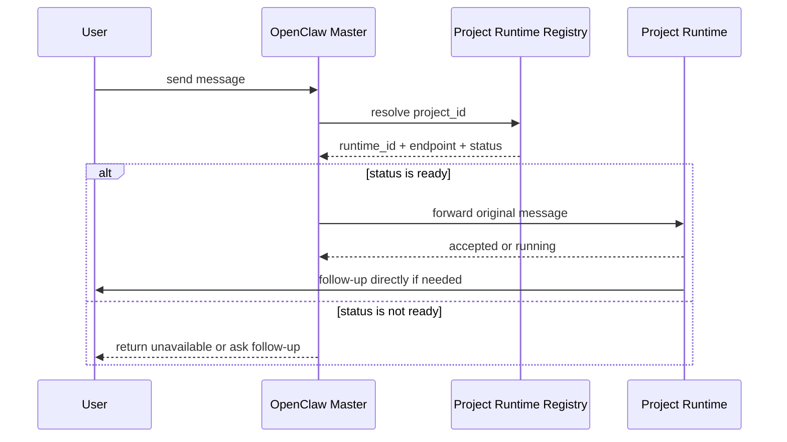

# Project Routing And Message Forwarding Spec

## 1. 目标

定义 Master 如何：

- 将消息路由到正确项目
- 将消息转发给正确 Runtime
- 保持最小化转发而非复杂任务编排

## 2. 路由原则

- 项目是高于 repo 的边界
- 一个项目只对应一个长期 Runtime
- Master 不精确命中 repo
- Runtime 自己决定涉及哪个 repo

## 3. 路由优先级

1. 用户显式指定项目
2. 命中项目映射
3. 命中辅助关键词规则
4. 无法判断时向用户追问

示例：

- “修一下 home-lab 的 ingress 问题”
  - 直接命中 `home-lab -> hermes-home-lab`
- “排查 alpha-trader 登录 bug”
  - 直接命中 `alpha-trader -> hermes-alpha-trader`
- “修一下登录问题”
  - 项目不明，Master 先追问

## 4. 最小消息转发协议

Master 不构造复杂任务包，只转发原始消息。

请求：

```json
{
  "project_id": "home-lab",
  "from": "openclaw-master",
  "author": "user",
  "message": "去帮我把项目 A 的登录 Bug 改了",
  "channel": "web"
}
```

## 5. Runtime 责任

Runtime 自己负责：

- 理解任务
- 判断是否需要补充信息
- 判断应操作哪个 repo
- 判断是否完成
- 必要时继续拆分子任务

## 6. 最小回报

Runtime 至少回报：

- `status`
- `summary`
- `next_action`

示例：

```json
{
  "project_id": "home-lab",
  "status": "running",
  "summary": "已接收，正在排查登录问题",
  "next_action": "如需补充信息将直接联系作者"
}
```

## 7. 调用时序


