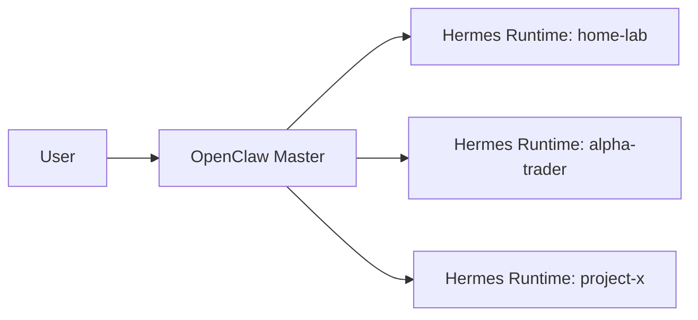
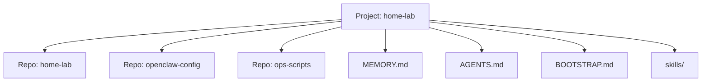
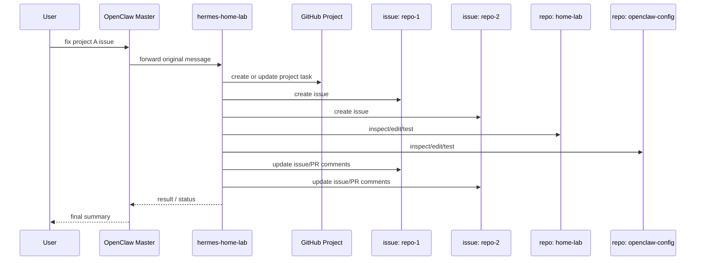

# OpenClaw Master + Hermes Project Agents 实施文档

## 1. 实施目标

本实施文档只关注如何把设计落地，不重复展开完整架构原理。

目标：

- 建立一个 OpenClaw Master
- 建立多个长期 Hermes Project Agents
- 打通动态注册
- 打通 Master 到 Hermes 的最小消息转发
- 让第一个项目 `hermes-home-lab` 可运行
- 将 AI team 相关定义从 `home-lab` 仓库拆分到 `womenlia/ai-team`

## 2. 最小可落地版本

建议只先建设：

- 一个 OpenClaw Master
- 两个 Hermes Project Agents
  - `hermes-home-lab`
  - `hermes-alpha-trader`
- 一套动态注册协议
- 一套最小消息转发协议

先不要做：

- 自动语义路由
- 自由多 Agent 对话
- 大规模自动编排
- 自动跨项目知识迁移

LLM 默认配置约束：

- OpenClaw Master 使用与 `hanbao` 相同的 provider 与 model 配置
- 每个 Hermes Runtime 默认也使用与 `hanbao` 相同的 provider 与 model 配置
- 第一阶段不单独为某个 Hermes 设计独立模型目录
- 如果后续某个项目确实需要特殊模型，再在该项目 Runtime 内单独覆盖

Git 管理边界：

- OpenClaw Master 与各个 Hermes Runtime 的声明性配置应通过 Git 管理
- 运行中的在线状态、heartbeat、live registry state 不通过 Git 管理
- Git 负责保存“如何重建一个 Master 或 Runtime”
- 运行时系统负责维护“它现在是否在线、是否可接单”

仓库边界：

- `womenlia/ai-team` 是 AI team 系统的主仓库
- `home-lab` 是基础设施与 Flux 部署仓库
- Team 文档、skills、Master/Hermes 配置模板应迁移到 `womenlia/ai-team`
- `home-lab` 中只保留指向 `womenlia/ai-team` 的 Flux 部署入口

## 3. Hermes 部署模型

这里需要明确一个关键点：

- Hermes 不是一个独立的多 agent Gateway
- Hermes 也不是“一个实例里面再创建多个长期项目 agent”的平台
- Hermes 在当前设计里就是一个项目对应的一个长期 Project Runtime 实例

所以部署模型应理解为：

- 一个 OpenClaw Master 作为统一入口
- 多个 Hermes Runtime 作为项目执行器
- 一个项目通常部署一个长期 Hermes 实例
- 多个项目就部署多个 Hermes 实例
- `womenlia/ai-team` 产出这些实例的声明性配置
- `home-lab` 负责把这些配置部署到集群



这意味着：

- 不存在“一个 Hermes Gateway 下面统一创建多个长期项目 agent”的部署形态
- 项目数量增加时，应增加 Hermes 实例数量
- 如果某个 Hermes 内部需要拆复杂任务，可以临时拉子执行器
- 这些子执行器不属于 Master 直接管理的长期 Runtime 名册

## 4. Hermes 与 Master 的连接方式

每个 Hermes Runtime 启动后，应主动向 Master 注册。

最小流程：

1. Hermes 启动
2. 加载自己的项目目录、`repo_map`、`MEMORY.md`、`skills/`
3. 连接 Master
4. 发送 `register`
5. 进入 heartbeat 循环
6. 等待 Master 派发属于该项目的任务

运行中：

- Hermes 不需要自己承担统一入口职责
- Hermes 不需要自己维护一个对外多 agent Gateway
- Hermes 只需要维护自己负责的项目上下文和执行能力
- Hermes 默认复用 `hanbao` 当前的 LLM/provider 配置

通过 Git 管理的内容通常包括：

- `AGENTS.md`
- `BOOTSTRAP.md`
- `MEMORY.md` 中可声明化的长期规则
- `skills/`
- `repo_map`
- `project-meta`
- 部署模板
- LLM/provider 默认配置

不通过 Git 直接管理的内容通常包括：

- 当前进程是否在线
- 当前是否已注册到 Master
- heartbeat 时间
- live registry state
- 临时会话上下文
- 短期运行态缓存

下线时：

- Hermes 发送 `unregister`
- Master 停止向其派单

## 5. 第一个项目：hermes-home-lab

### 5.1 目标

`hermes-home-lab` 是第一个落地的长期项目 Hermes。

它负责：

- 维护 home-lab 相关的所有仓库
- 处理与 OpenClaw、k3s、Flux、OpenClaw 部署相关的任务
- 积累 home-lab 项目的长期经验
- 为后续其他项目 Hermes 提供模板

这里需要区分两个仓库层次：

- `womenlia/ai-team` 存放 `hermes-home-lab` 这个 Runtime 的定义
- `hermes-home-lab` 运行后再去管理 `home-lab` 等业务或基础设施仓库

### 5.2 项目范围

一个项目不等于一个 repo。

`hermes-home-lab` 可以同时管理多个外部 repo，例如：

- `home-lab` 主仓库
- `openclaw` 配置相关仓库
- 其他运维或文档仓库

建议每个受管 repo 都在 Hermes 自己维护的 `repo_map` 中有明确角色定义。
此外，项目默认关联一个项目管理工具，第一阶段可先使用 GitHub Project，作为：

- 任务归属主入口
- issue / PR 协作主视图
- 跨 repo 任务聚合容器

该信息由 Hermes 内部维护，不进入 Master Registry。

建议补充一条明确流程：

- 用户任务先进入项目管理工具
- Hermes 再按 repo 或子任务拆成对应 issue
- 每个 issue 绑定自己的开发分支和 PR
- 过程沟通尽量沉淀在 issue comment 或 PR comment 中
- 对用户的补充确认如果发生在聊天通道，也应尽量回写到对应 issue 或 PR

### 5.3 推荐目录结构



建议在 Hermes 自己的项目根目录下维护：

- `MEMORY.md`
- `AGENTS.md`
- `BOOTSTRAP.md`
- `skills/`
- `repo_map.json`
- `project-meta.json`
- `tasks/`

其中 `skills/` 建议分为两层：

- 基础工程技能层：默认使用 [mattpocock/skills](https://github.com/mattpocock/skills)
- 项目补充技能层：维护项目自己的 repo 规则、分支规范、发布流程、测试约束

### 5.4 repo_map 建议

`repo_map` 用来描述一个项目下多个 repo 的职责。

示例：

```json
{
  "project_id": "home-lab",
  "project_management_tool": "github-project://womenlia/home-lab",
  "repo_map": {
    "team": {
      "path": "/srv/projects/ai-team",
      "purpose": "AI team 系统定义仓库"
    },
    "main": {
      "path": "/srv/projects/home-lab",
      "purpose": "home-lab 主仓库"
    },
    "openclaw": {
      "path": "/srv/projects/openclaw-config",
      "purpose": "OpenClaw 配置与部署"
    },
    "ops": {
      "path": "/srv/projects/home-lab-ops",
      "purpose": "运维脚本与辅助工具"
    }
  }
}
```

### 5.5 project-meta 建议

建议再维护一份项目元数据，用于描述项目级身份信息。

示例：

```json
{
  "project_id": "home-lab",
  "display_name": "Home Lab",
  "project_management_tool": "github-project://womenlia/home-lab",
  "primary_repo": "team"
}
```

### 5.6 Hermes 判断 repo 的规则

Hermes 接到任务后，先判断：

1. 是否明确指定 repo
2. 是否能从任务内容判断涉及哪些 repo
3. 如果涉及多个 repo，是否需要拆分子任务
4. 如果无法判断，是否需要向 Master/用户追问

在完成 repo 判断后，Hermes 还应决定：

1. 是否需要创建一个主 issue 作为总任务入口
2. 是否需要为不同 repo 创建拆分 issue
3. 是否需要将这些 issue 全部挂到同一个项目管理工具条目集下
4. 是否需要为每个 issue 分配独立分支和 PR

### 5.7 首个 Hermes 的最小能力集

第一版建议只包含：

- 读写多个 repo
- 修改配置
- 运行测试
- 生成总结
- 更新项目级 `MEMORY.md`
- 使用 `mattpocock/skills` 驱动需求澄清、调试、测试与交付流程
- 使用与 `hanbao` 一致的 LLM/provider 配置

先不要做：

- 自动创建 repo
- 自动拆分成多个 Hermes
- 自动跨项目迁移知识

第一阶段建议明确区分：

- `womenlia/ai-team` 负责维护 team 系统自身
- `hermes-home-lab` 负责执行与 `home-lab` 项目相关的工作

第一阶段建议默认安装并优先使用的基础技能可以包括：

- `/setup-matt-pocock-skills`
- `/grill-with-docs`
- `/triage`
- `/tdd`
- `/diagnose`
- `/requesting-code-review`
- `/document-release`

### 5.8 首个 Hermes 的最小任务流



### 5.9 验收标准

`hermes-home-lab` 的最小验收标准：

- 能稳定识别 home-lab 项目任务
- 能在多个 repo 之间选择正确工作目录
- 能将任务拆分并沉淀到默认项目管理工具
- 能给出结构化回包
- 能把项目经验沉淀到 `MEMORY.md`
- 能把默认项目管理工具作为任务归属入口

## 6. 实施顺序

### Phase 1

- 定义项目列表
- 定义 Hermes 命名规范
- 定义动态注册协议
- 定义最小消息转发协议

### Phase 2

- 部署两个长期 Hermes
- 打通 Master 到 Hermes 的调用链路
- 打通结果回传链路

### Phase 3

- 为每个 Hermes 初始化隔离记忆与技能目录
- 增加任务状态追踪
- 增加健康检查

### Phase 4

- 增加跨项目协调
- 增加更强的自动化与观测能力

## 7. 实施建议

- 先让 `hermes-home-lab` 跑通，再复制模式到第二个项目
- 先确保动态注册和消息转发稳定，再增加更复杂的流程
- 先固定项目边界，再逐步增加自动化能力
- 不要先设计“Hermes Gateway 管多个长期 agent”的模型
- 先坚持“一项目一长期 Hermes Runtime”
