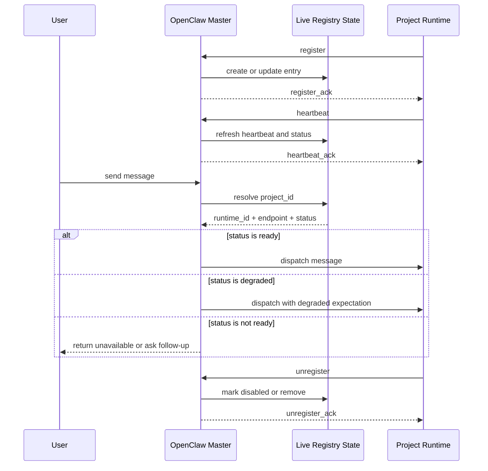

# Project Runtime Registration And Registry Spec

## 1. 目标

定义 OpenClaw Master 如何：

- 接收 Project Runtime 的动态注册
- 维护可调度的 live registry state
- 基于 registry state 完成项目级路由

本规范同时覆盖：

- Registry Entry 结构
- 注册消息
- 状态模型
- 单项目单 active runtime 约束

## 2. 核心约束

- 只保留项目级路由必需字段
- 不保存 repo_map、workspace、skills 等内部细节
- 任一时刻，一个 `project_id` 只能绑定一个 active Runtime
- `ready` 与 `degraded` 都视为 active
- `disabled` 与 `unreachable` 不参与接单
- 运行时以动态注册为准
- Master 只读取 live registry state 进行调度

## 3. Registry Entry

每个项目在 Registry 中只对应一条 live entry。

Registry 最小字段集如下：

| 字段 | 含义 |
| --- | --- |
| `project_id` | 项目唯一标识 |
| `runtime_id` | 当前承接该项目的 Runtime 唯一标识 |
| `display_name` | 便于展示和排查的人类可读名称 |
| `endpoint` | Master 向 Runtime 发消息时使用的目标地址 |
| `protocol` | 访问 `endpoint` 所使用的协议，第一阶段固定为 `acp` |
| `status` | 当前是否可接单 |
| `last_heartbeat_at` | 最近一次心跳时间 |
| `last_error` | 最近一次已知错误，若无则为 `null` |

示例：

```json
{
  "project_id": "home-lab",
  "runtime_id": "home-lab",
  "display_name": "Hermes Home Lab",
  "endpoint": "acp://hermes-home-lab",
  "protocol": "acp",
  "status": "ready",
  "last_heartbeat_at": "2026-05-15T12:00:00Z",
  "last_error": null
}
```

## 4. 状态模型

状态值统一定义为：

| 状态 | 含义 | 是否 active |
| --- | --- | --- |
| `ready` | 可正常接单 | 是 |
| `degraded` | 可通信，但能力受限 | 是 |
| `unreachable` | 当前不可达 | 否 |
| `disabled` | 管理上禁用，不参与路由 | 否 |

附加约束：

- 同一个 `project_id` 不能同时存在多个 `ready` 或 `degraded` 的 Runtime
- 若发生迁移，旧 Runtime 必须先退出 active 状态，再由新 Runtime 接管

## 5. 非目标

Registry 不维护：

- `repo_map`
- `project_management_tool`
- Runtime 工具能力清单
- Runtime skills 明细

这些信息由 Runtime 自己维护。

## 6. 注册消息

协议只定义三类消息：

- `register`
- `heartbeat`
- `unregister`

### 6.1 register

用途：

- Runtime 首次向 Master 报到
- 建立 live registry entry

请求：

```json
{
  "type": "register",
  "project_id": "home-lab",
  "runtime_id": "home-lab",
  "display_name": "Hermes Home Lab",
  "endpoint": "acp://hermes-home-lab",
  "protocol": "acp",
  "status": "ready",
  "registered_at": "2026-05-15T12:00:00Z"
}
```

响应：

```json
{
  "type": "register_ack",
  "project_id": "home-lab",
  "runtime_id": "home-lab",
  "accepted": true,
  "message": "registered"
}
```

Master 行为：

1. 校验消息格式
2. 检查该 `project_id` 是否已有 active Runtime
3. 若已有其他 active Runtime，则拒绝注册或要求先切换
4. 若无冲突，则创建或更新 live registry entry
5. 返回 `register_ack`

### 6.2 heartbeat

用途：

- 刷新在线状态
- 刷新最近活动时间

请求：

```json
{
  "type": "heartbeat",
  "project_id": "home-lab",
  "runtime_id": "home-lab",
  "status": "ready",
  "sent_at": "2026-05-15T12:05:00Z"
}
```

响应：

```json
{
  "type": "heartbeat_ack",
  "project_id": "home-lab",
  "runtime_id": "home-lab",
  "accepted": true,
  "message": "heartbeat accepted"
}
```

Master 行为：

1. 查找 live registry entry
2. 更新 `last_heartbeat_at`
3. 更新 `status`
4. 若不存在则拒绝 heartbeat

### 6.3 unregister

用途：

- Runtime 主动下线
- Master 停止向其派单

请求：

```json
{
  "type": "unregister",
  "project_id": "home-lab",
  "runtime_id": "home-lab",
  "reason": "shutdown",
  "sent_at": "2026-05-15T13:00:00Z"
}
```

响应：

```json
{
  "type": "unregister_ack",
  "project_id": "home-lab",
  "runtime_id": "home-lab",
  "accepted": true,
  "message": "unregistered"
}
```

Master 行为：

1. 查找 live registry entry
2. 标记为 `disabled` 或移除
3. 停止向该 Runtime 派单

## 7. 超时与失联

若未收到 `unregister`，Master 依赖 heartbeat 超时判断失联。

建议：

- 超过一个 heartbeat 周期：`degraded`
- 超过多个 heartbeat 周期：`unreachable`

第一阶段建议：

- 保留条目
- 仅更新状态

## 8. 路由使用方式

Master 路由时：

1. 从 live registry state 找到项目归属 Runtime
2. 检查其 `status`
3. `ready` 则正常派单
4. `degraded` 则按降级模式派单或提示能力受限
5. `unreachable` 或 `disabled` 则报不可用或继续追问

## 9. 时序


