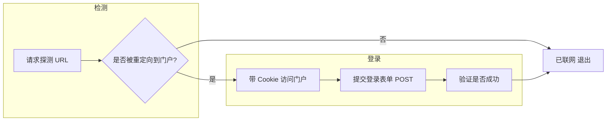

# 公司门户自动检测与自动登录方案

## 背景与目标

- **现象**：在公司网络下，未认证时访问外网（如 baidu.com）会被重定向到门户认证页（你提供的 `https://192.168.222.250:19008/portalpage/.../authSuccess.html?...` 这类 URL），需输入用户名密码才能上网。
- **目标**：编写程序自动检测「当前是否需要门户认证」，并在需要时自动提交用户名密码完成登录；可定时执行或手动触发。

## 整体思路

- **检测**：用 `curl` 请求一个会触发门户重定向的地址（例如 `http://www.baidu.com` 或 `http://connectivitycheck.gstatic.com/generate_204`），若返回 302/200 且 `Location` 或最终 URL 包含门户特征（如 `192.168.222.250:19008`、`/portalpage/`），则判定需要登录。
- **登录**：先 GET 门户登录页（或你提供的 URL）拿 Cookie，再根据实际表单用 POST 提交用户名、密码及页面上的隐藏字段（若有）；成功后再次探测，确认不再被重定向即视为成功。

**注意**：你给的链接是 `authSuccess.html`，多为「已认证成功」后的展示页；实际「输入账号密码」的页面可能是同目录下的 `login.html` 或根路径。具体表单的 action、input 的 name、以及是否需验证码，需要你在浏览器里抓一次请求才能确定（见下文「需要你提供的信息」）。

## 需要你提供的信息（实现前必做）

门户服务器在内网（192.168.x.x），无法从本机直接抓取页面，以下需你在**已连公司 Wi-Fi 且被重定向到门户时**在浏览器里操作一次：

1. **登录表单的提交方式**
  - 打开门户登录页（或从 baidu.com 被重定向过去的那页），按 F12 → **Network**，勾选 "Preserve log"。
  - 输入用户名、密码并点击登录，在 Network 里找到**提交登录的那条请求**（多为 **POST**，名称可能为 login、doLogin、auth 等）。
  - 对该请求：**右键 → Copy → Copy as cURL (bash)**，把复制出的 cURL 发给我（可先脱敏密码），或至少提供：
    - 请求 URL（可能为 `https://192.168.222.250:19008/...` 的某个 path）
    - Method：POST
    - Request Headers 中的 `Content-Type`、`Origin`、`Referer` 等
    - Body 里所有参数名和含义（如 username、password、以及 URL 里可能带上的 ac-ip、uaddress、umac 等是否也要原样 POST）
2. **是否需要验证码**
  - 若登录前有图形/滑块验证码，简单 curl 脚本无法自动通过，需考虑浏览器自动化（如 Playwright）或半自动（脚本打开浏览器到登录页，你手动点验证码后再自动填账号密码）。
3. **探测 URL 的约定**
  - 你希望用哪个 URL 做「是否需要登录」的探测？例如：
    - `http://www.baidu.com`
    - 或 `http://connectivitycheck.gstatic.com/generate_204`（返回 204 表示已放行）
  - 确认后脚本会只请求该 URL，根据重定向是否指向门户来判定。

提供上述信息后，可以实现一个**可配置**的脚本，把「门户根 URL、登录 POST 的 URL、参数名、探测 URL」等放进配置，用户名密码从环境变量或本地配置文件读取（不入 Git）。

## 技术方案概要

- **实现形式**：Shell 脚本 + `curl`（与现有 [wlan/ensure-wifi.sh](wlan/ensure-wifi.sh) 风格一致）；若存在验证码则再考虑 Python + Playwright 的补充方案。
- **配置与凭证**：
  - 在仓库中新增目录，例如 `portal/` 或 `corp-portal/`。
  - 配置文件：如 `portal.conf` 或 `portal.conf.example`，包含：
    - 门户 base URL（如 `https://192.168.222.250:19008`）
    - 探测 URL、登录 POST URL、以及表单参数名（username、password 等）
    - 不包含密码；密码通过环境变量（如 `PORTAL_PASSWORD`）或仅本机存在的 `portal.secret`（权限 600）读取，并在 README 中说明。
  - 提供 `portal.conf.example` 和 `portal.secret.example`，在 README 中说明复制为 `portal.conf` / `portal.secret` 并填写。
- **检测逻辑**：
  - `curl -sI -L -o /dev/null -w "%{url_effective}\n%{http_code}" "$PROBE_URL"` 获取最终 URL 和状态码。
  - 若最终 URL 包含门户特征（如 `192.168.222.250:19008` 或 `/portalpage/`），则判定需要登录。
- **登录逻辑**：
  - 先 GET 登录页（或你提供的入口 URL）保存 Cookie（`-c cookie.txt`）。
  - 用 `-X POST -b cookie.txt -c cookie.txt -d "user=...&pass=..."` 提交表单；若有动态参数（如 token、ac-ip、uaddress），从 GET 到的 HTML 或当前 URL 中解析，或按你抓到的 cURL 写死/从配置读取。
  - 提交后再次请求探测 URL，若不再被重定向到门户则视为成功。
- **定时与手动**：
  - 参考 [wlan/ensure-wifi-timer.sh](wlan/ensure-wifi-timer.sh)，提供 systemd timer 示例（如每 5–10 分钟执行一次），仅在公司网络下才有意义，可在 README 中说明「仅在公司环境启用」。
  - 支持单次执行：`./portal-auto-login.sh`（检测 + 如需则登录）。

## 建议目录与文件

| 路径                                                              | 说明                                |
| --------------------------------------------------------------- | --------------------------------- |
| `portal/portal-auto-login.sh`                                   | 主脚本：检测 + 登录，可执行                   |
| `portal/portal.conf.example`                                    | 配置示例（门户 URL、探测 URL、POST URL、参数名等） |
| `portal/portal.secret.example`                                  | 凭证示例（用户名/密码占位，说明用 env 或本文件）       |
| `portal/README.md`                                              | 使用说明、如何抓 cURL、如何配置 timer          |
| `portal/portal.service.example` / `portal/portal.timer.example` | 可选 systemd 定时任务模板                 |

## 安全与注意事项

- 密码不提交到 Git；`.gitignore` 中加入 `portal.secret`、`portal.conf`（若你选择把非敏感配置也放在同一文件则可只忽略 `portal.secret`）。
- 脚本仅在本地或公司内网使用；若需在公网环境运行，建议使用 keychain 等存储密码（macOS 可用 `security find-generic-password` 读取）。
- 若公司策略禁止自动登录或明文保存密码，需改用合规方式（如手动登录一次后长期有效则不自动填密）。

## 下一步

请你先在公司网络下按「需要你提供的信息」抓一次登录请求（cURL 或 URL + 表单参数列表），并确认探测 URL 与是否含验证码。拿到这些后即可在 `portal/` 下实现具体脚本和配置模板，并与现有 wlan 风格对齐。